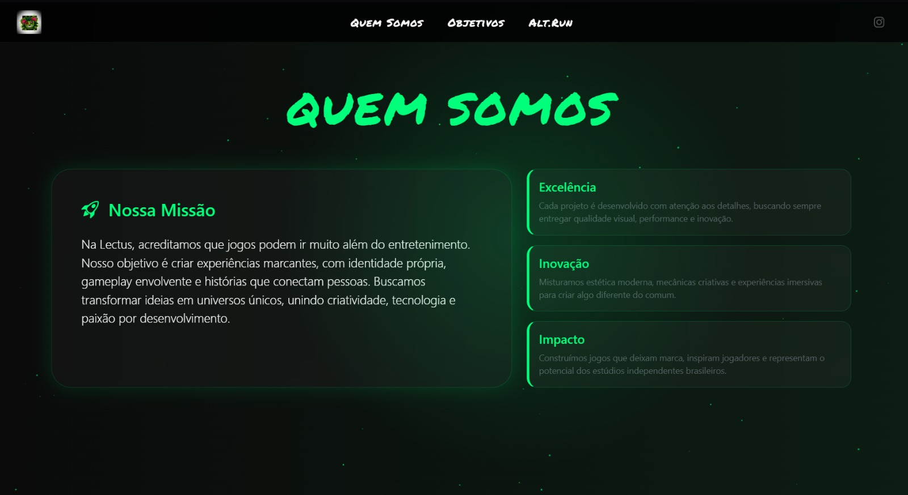
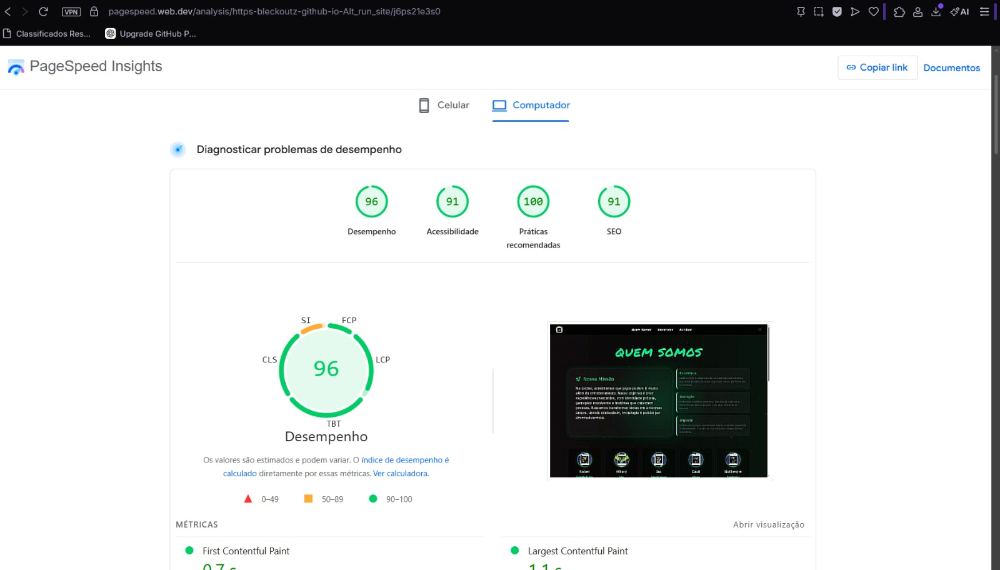

# AltRun Studio 🚀

Experiência web desenvolvida para representar o universo ALT.RUN, combinando identidade visual neon, animações interativas e foco extremo em performance.

<!-- Preview do Site -->

---

### ⚡ Performance & Qualidade
O projeto foi otimizado para oferecer a melhor experiência possível ao usuário, atingindo métricas de elite no **PageSpeed Insights**. Este resultado comprova o compromisso com a performance, mesmo em um site com forte apelo visual.

<!-- Resultados do PageSpeed -->

* **Desempenho:** 96
* **Acessibilidade:** 91
* **Práticas Recomendadas:** 100
* **SEO:** 91

---

### 🛠 Tecnologias Utilizadas
* **HTML5:** Estrutura semântica.
* **CSS3:** Estilização avançada, animações neon e layouts responsivos.
* **JavaScript:** Interatividade e manipulação de DOM para efeitos dinâmicos.

---

### ✨ Funcionalidades
* **Totalmente Responsivo:** Adaptado para diversos tamanhos de tela.
* **Identidade Visual Imersiva:** Estilo focado em tecnologia com transições suaves.
* **SEO Otimizado:** Estrutura preparada para indexação.
* **GitHub Pages:** Deploy automatizado e estável.

---

### 🔗 Acesso ao Site
👉 **[bleckoutz.github.io/Alt_run_site/](https://bleckoutz.github.io/Alt_run_site/)**

---
**Autor:** Rafael Eduardo (Bleckoutz)
